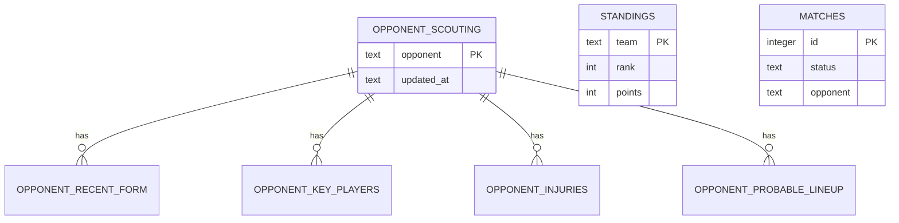

# ERD 명세서: 구단 정보 (순위표 · 경기 · 상대 스카우팅)

- **문서 버전**: v1.0
- **작성일**: 2026-07-16
- **연관 문서**: PRD.md (v1.2, F-16·F-17·F-18), ERD_SPEC.md(응원가 — 동일 설계 원칙 적용)
- **목적**: `lib/api/matches.ts`·`standings.ts`·`opponentScouting.ts`가 읽는 `data/*.json` 데이터의 **관계형 설계 참고서**입니다. (2026-07-16 갱신: 앱은 런타임에 이 JSON을 직접 읽습니다 — SQLite 적재 경로는 제거됐고, 이 스키마는 향후 실제 DB 도입 시의 기준으로 남습니다. ERD_SPEC.md와 동일한 위상.)
- **적용 범위 밖**: `lib/api/headToHead.ts`(상대전적)는 매 요청마다 API-Football을 실시간 조회하고 결과를 자체 저장하지 않으므로 이 문서의 스키마 대상이 아닙니다.

---

## 0. 설계 전제 — 이 데이터는 "실시간"이 아니라 "주기 갱신 스냅샷"이다

PRD.md F-16·F-17에 따르면 순위표·지난 경기·최근 5경기는 무료 API로 실시간 연동이 불가능해, **초안을 만들고 사람이 검수 후 반영**하는 방식으로 운영합니다. 초안 생성 수단은 2026-07-16부로 공개 순위 API 크롤링(다음 스포츠, `scraper/`, CRAWLER_SPEC.md)으로 전환했습니다 — 크롤러가 `data/standings.json` + `data/standings-meta.json` + 수집일별 이력을 만들고, 앱은 이 JSON을 런타임에 직접 읽습니다(순위표 구현 완료, 자동 스케줄링은 GitHub Actions 워크플로우로 구성).

그래서 이 문서의 테이블들은 공통적으로:
- 한 번에 여러 행이 갱신 시점마다 통째로 교체되는 "스냅샷" 성격을 가집니다.
- 화면에 "이 데이터가 언제 기준인지" 보여줄 수 있도록 `updated_at` 컬럼을 둡니다 (지금 화면의 "예시 데이터" 배지를 나중에 "2026-07-13 기준"류로 바꿀 근거가 됩니다).
- ERD_SPEC.md와 동일하게 `snake_case` 컬럼명, camelCase API 필드와의 대응을 표로 남깁니다.

---

## 1. STAGE 1 — standings (K리그1 순위표, F-17)

가장 단순한 구조입니다: 관계 없는 평면 테이블 하나, 매주 12행 전체가 교체됩니다.

| 컬럼명 | 타입 | 제약조건 | 설명 (API 필드 대응) |
|--------|------|----------|----------------------|
| team | text | PK | `team` — 팀명이 코드 전반에서 이미 자연키로 쓰이고 있어(`KOREAN_TEAM_NAME` 매핑 등) 그대로 PK로 사용 |
| rank | int | NOT NULL | `rank` |
| played | int | NOT NULL | `played` |
| win | int | NOT NULL | `win` |
| draw | int | NOT NULL | `draw` |
| lose | int | NOT NULL | `lose` |
| goals_for | int | NOT NULL | `goalsFor` |
| goals_against | int | NOT NULL | `goalsAgainst` |
| points | int | NOT NULL | `points` |
| updated_at | text (ISO datetime) | NOT NULL | 이 스냅샷이 반영된 시각 (주간 검수 반영 시점) |

**갱신 방식**: 매주 전체 12행을 `DELETE` 후 재삽입 (부분 갱신 아님 — 순위표는 항상 리그 전체 스냅샷이므로).

---

## 2. STAGE 2 — matches (지난 경기 결과 · 다가오는 매치, F-16)

관계 없는 평면 테이블. `status`가 `finished`/`upcoming` 두 상태를 가지며, 점수는 API의 중첩 객체(`score: {incheon, opponent}`)를 SQLite에 저장 가능하도록 평평하게 풉니다.

| 컬럼명 | 타입 | 제약조건 | 설명 (API 필드 대응) |
|--------|------|----------|----------------------|
| id | integer | PK | `id` — 기존 mock의 비연속 id(1~6,8,9)를 그대로 보존 |
| round | text | NOT NULL | `round` |
| kickoff_at | text (ISO datetime) | NOT NULL | `kickoffAt` |
| status | text | NOT NULL, CHECK (`'finished'` 또는 `'upcoming'`) | `status` |
| opponent | text | NOT NULL | `opponent` |
| is_home | integer | NOT NULL (0/1) | `isHome` |
| score_incheon | integer | NULL 허용 | `score.incheon` (status=`upcoming`이면 NULL) |
| score_opponent | integer | NULL 허용 | `score.opponent` (status=`upcoming`이면 NULL) |
| venue | text | NOT NULL | `venue` |
| updated_at | text (ISO datetime) | NOT NULL | 이 행이 검수 반영된 시각 |

**참고**: `getUpcomingMatch()`는 TheSportsDB 실시간 조회가 우선이고 실패 시에만 이 테이블의 `status='upcoming'` 행을 폴백으로 쓰는 현재 로직(`lib/api/matches.ts`)을 그대로 유지합니다 — 이 테이블 도입이 실시간 연동 자체를 바꾸지 않습니다.

---

## 3. STAGE 3 — opponent scouting (다가오는 상대 정보, F-18)

가장 복잡한 구조 — 상대 1팀에 대해 여러 하위 목록(최근 폼·주요 선수·부상·예상 라인업)이 딸려 있어 정규화가 필요합니다. **주의**: PRD상 실존 선수 개인정보 리스크로 이 데이터는 당분간 익명 처리된 mock을 유지하기로 되어 있어 — 실데이터로 바뀔 계획이 없다면 JSON 파일 그대로 두고 이 단계는 보류해도 됩니다. 그래도 설계는 남겨둡니다.

### 3.1 opponent_scouting (부모)

| 컬럼명 | 타입 | 제약조건 | 설명 |
|--------|------|----------|------|
| opponent | text | PK | 상대팀명 — 현재는 항상 "다가오는 매치의 상대" 1건만 존재 |
| updated_at | text (ISO datetime) | NOT NULL | 검수 반영 시각 |

`matchId` 필드는 스키마에서 제외합니다 — 현재 mock 데이터 자체가 존재하지 않는 `matches.id`를 참조하고 있고(`matchId: 7`), 화면 로직도 `opponent`로만 조회하지 `matchId`는 쓰지 않습니다(`app/club/opponent/page.tsx` 참고).

### 3.2 opponent_recent_form (1:N)

| 컬럼명 | 타입 | 제약조건 | 설명 |
|--------|------|----------|------|
| id | integer | PK, AUTOINCREMENT | 내부 식별자 |
| opponent | text | NOT NULL, FK → opponent_scouting(opponent) ON DELETE CASCADE | |
| date | text | NOT NULL | `recentForm[].date` |
| opponent_faced | text | NOT NULL | `recentForm[].opponentFaced` |
| result | text | NOT NULL, CHECK (`'W'`/`'D'`/`'L'`) | `recentForm[].result` |
| score | text | NOT NULL | `recentForm[].score` (예: `"2-1"`) |

### 3.3 opponent_key_players (1:N)

| 컬럼명 | 타입 | 제약조건 | 설명 |
|--------|------|----------|------|
| id | integer | PK, AUTOINCREMENT | |
| opponent | text | NOT NULL, FK → opponent_scouting(opponent) ON DELETE CASCADE | |
| name | text | NOT NULL | `keyPlayers[].name` (익명 처리 원칙 유지) |
| position | text | NOT NULL | `keyPlayers[].position` |
| note | text | NOT NULL | `keyPlayers[].note` |

### 3.4 opponent_injuries (1:N)

| 컬럼명 | 타입 | 제약조건 | 설명 |
|--------|------|----------|------|
| id | integer | PK, AUTOINCREMENT | |
| opponent | text | NOT NULL, FK → opponent_scouting(opponent) ON DELETE CASCADE | |
| name | text | NOT NULL | `injuries[].name` |
| status | text | NOT NULL | `injuries[].status` |
| expected_return | text | NOT NULL | `injuries[].expectedReturn` |

### 3.5 opponent_probable_lineup (1:N, 순서 있음)

| 컬럼명 | 타입 | 제약조건 | 설명 |
|--------|------|----------|------|
| id | integer | PK, AUTOINCREMENT | |
| opponent | text | NOT NULL, FK → opponent_scouting(opponent) ON DELETE CASCADE | |
| player_name | text | NOT NULL | `probableLineup[]` 원소 |
| sort_order | int | NOT NULL | 배열 순서 보존 (videos 테이블의 `sort_order`와 동일 패턴) |

---

## 4. 관계 다이어그램

`standings`·`matches`·`opponent_scouting`은 서로 FK로 묶여 있지 않습니다 — 세 도메인이 각자 독립적인 스냅샷이며, "다가오는 매치의 상대"라는 개념적 연결은 `opponent`(팀명 문자열) 값이 우연히 같다는 것으로만 화면 코드(`app/club/opponent/page.tsx`)에서 조합됩니다.

---

## 변경 이력 (Changelog)

| 버전 | 날짜 | 내용 |
|------|------|------|
| v1.0 | 2026-07-16 | 최초 작성. standings·matches·opponent_scouting(+ 4개 하위 테이블) 스키마 정의. head-to-head는 실시간 조회라 범위 밖으로 명시 |
