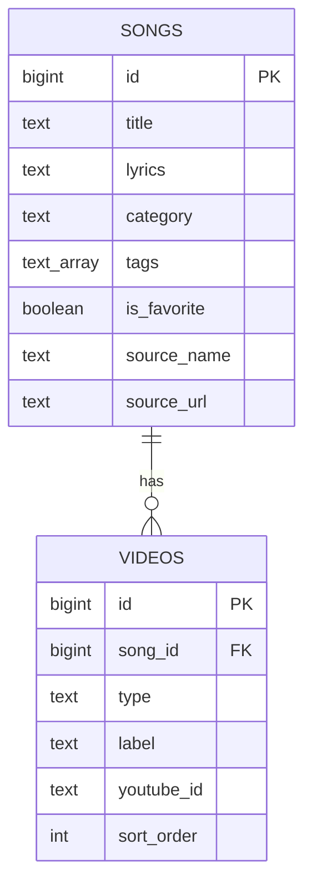

# ERD 명세서: 인천 유나이티드 응원가 데이터베이스

- **문서 버전**: v1.2
- **작성일**: 2026-07-13
- **연관 문서**: API_SPEC.md (v1.0, 2장 데이터 모델), FUNCTION.md (v1.0, F-01·F-04), PRD.md (v1.2, 6장 데이터 구조), TECHSTACK.md (v1.1, 2.6 확장용 DB)
- **목적**: API_SPEC.md 2장의 JSON 데이터 모델을, 확장 시점(TECHSTACK.md 2.6 — Supabase 도입)에 그대로 옮길 수 있는 **관계형 테이블 구조**로 정의합니다.
- **적용 범위**: MVP 단계에서는 `data/songs.json` 파일로 대체되어 실제로 생성되지 않는 테이블입니다. Supabase 등 DB 도입 시 이 문서를 기준으로 스키마를 생성합니다.

---

## 0. 설계 원칙

- API_SPEC.md 2장의 필드명은 그대로 유지하되, DB 컬럼명은 관계형 DB 관례에 따라 `snake_case`로 표기합니다. (예: `isFavorite` → `is_favorite`, `youtubeId` → `youtube_id`)
- `videos`는 API 응답에서 배열이지만, 각 항목이 `type`/`label`/`youtubeId`라는 자체 속성을 가지므로 **별도 테이블로 정규화**하고 `songs`와 1:N 관계로 연결합니다.
- `tags`는 각 태그가 자체 속성을 갖지 않는 단순 문자열 목록이므로, 별도 테이블 없이 **배열 컬럼**으로 유지합니다. (Postgres/Supabase 기준 `text[]` 지원)
- F-04(FUNCTION.md)에서 "기본값은 videos 목록의 **첫 번째 영상**"이라는 규칙이 있어, 관계형 테이블에서 배열 순서를 잃지 않도록 `videos` 테이블에 `sort_order` 컬럼을 둡니다.

---

## 1. 테이블 목록

| 테이블명 | 설명 | 관련 기능 |
|----------|------|-----------|
| songs | 응원가 1건당 1행 | F-01, F-02, F-04, F-11 |
| videos | 응원가에 속한 영상 1건당 1행 | F-04 |

---

## 2. songs 테이블

| 컬럼명 | 타입 | 제약조건 | 기본값 | 설명 (API 필드 대응) |
|--------|------|----------|--------|----------------------|
| id | bigint | PK, auto increment | - | `id` |
| title | text | NOT NULL | - | `title` |
| lyrics | text | NOT NULL | `''` | `lyrics`, 줄바꿈(`\n`) 포함 |
| category | text | NOT NULL | `'팀 응원가'` | `category`. 현재 사용 값: `'팀 응원가'` / `'선수 응원가'` — F-01 기본 정렬의 묶음 기준 |
| tags | text[] | NOT NULL | `'{}'` | `tags`. 현재 사용 값: `'미사용'`(F-01 배지 + 맨 아래 묶음), `'대표곡'`(배지만 — 정렬에는 관여하지 않음, FUNCTION.md v1.1) |
| is_favorite | boolean | NOT NULL | `false` | `isFavorite` — 예약 필드(현재 화면 미사용), rules.md 2장에 따라 구조 유지 |
| source_name | text | NULL 허용 | `NULL` | `source.name` — 가사 출처 이름 |
| source_url | text | NULL 허용 | `NULL` | `source.url` — 가사 출처 원문 URL |

**`source`를 별도 테이블로 정규화하지 않는 이유**: `videos`와 달리 `source`는 곡당 **최대 1건**이고
(1:N이 아님), `name`/`url` 두 속성뿐이라 별도 테이블의 이점이 없습니다. 0장 설계 원칙에 따라
API 응답에서는 중첩 객체(`source: {name, url}`)지만 테이블에서는 두 컬럼으로 평평하게 풉니다.
`videos`처럼 순서를 보존할 필요도 없어 `sort_order`도 불필요합니다.

**NULL 허용인 이유**: 손으로 등록하는 곡은 출처를 모를 수 있습니다. *(2026-07-17 기준 실제로
NULL인 곡은 없습니다 — 크롤러 도입 이전에 손으로 넣었던 id 1·3도 `reconcile_songs.py`가 크롤
결과와 대조해 채웠습니다. 그래도 NOT NULL로 올리지 않는 이유는, 출처가 확인되지 않은 곡을
넣어야 할 때 스키마가 막아서면 안 되기 때문입니다.)*
두 컬럼은 **함께 NULL이거나 함께 채워집니다** — 실제 DB 도입 시
`CHECK ((source_name IS NULL) = (source_url IS NULL))` 제약으로 강제하는 것을 권장합니다.

---

## 3. videos 테이블

| 컬럼명 | 타입 | 제약조건 | 기본값 | 설명 (API 필드 대응) |
|--------|------|----------|--------|----------------------|
| id | bigint | PK, auto increment | - | (API에는 없는 내부 식별자) |
| song_id | bigint | NOT NULL, FK → songs.id (ON DELETE CASCADE) | - | 소속 응원가 |
| type | text | NOT NULL, CHECK (`'official'` 또는 `'live'`) | - | `type` |
| label | text | NOT NULL | - | `label` |
| youtube_id | text | NOT NULL | - | `youtubeId` |
| sort_order | int | NOT NULL | `0` | 배열 내 순서 보존 — F-04 "기본값은 첫 번째 영상" 규칙에 필요 |

---

## 4. 관계 (Relationships)

- **songs 1 : N videos** — 응원가 한 곡은 영상을 0개 이상 가질 수 있고(F-04 "영상 0개" 상태), 각 영상은 정확히 하나의 응원가에 속합니다.
- 응원가 삭제 시 소속 영상도 함께 삭제됩니다(`ON DELETE CASCADE`) — API_SPEC.md 3.5 DELETE 엔드포인트와 일치.

---

## 5. API 응답 조합 방식 (참고)

- `GET /api/songs`, `GET /api/songs/{id}` 응답의 `videos` 배열은 `videos` 테이블에서 `song_id`로 조회 후 `sort_order` 오름차순 정렬하여 조립합니다.
- 이 조합 로직은 `lib/api/songs.ts` 내부 구현(API_SPEC.md 5장)에 위치하며, 화면(컴포넌트)은 지금과 동일하게 API_SPEC.md 2장 형태의 JSON만 소비합니다.

---

## 변경 이력 (Changelog)

| 버전 | 날짜 | 내용 |
|------|------|------|
| v1.2 | 2026-07-17 | `source_name`·`source_url`의 NULL 허용 근거 정정 — "현재 id 1·3이 NULL"이라고 적혀 있었으나 실제로는 34곡 전부 채워져 NULL인 곡이 없음(`reconcile_songs.py`). NULL 허용 자체는 유지하며, 그 이유를 '현재 상태'가 아니라 '앞으로 출처 미확인 곡이 들어올 수 있음'으로 다시 씀 |
| v1.1 | 2026-07-17 | songs 테이블에 `source_name`·`source_url`(가사 출처, NULL 허용) 컬럼 추가 — API_SPEC.md v1.2의 Source 객체 대응. 별도 테이블로 정규화하지 않는 근거와 두 컬럼의 동시 NULL 제약 명시 |
| v1.0 | 2026-07-13 | API_SPEC.md·FUNCTION.md 기반 최초 작성. songs/videos 2개 테이블, 1:N 관계 정의 |
